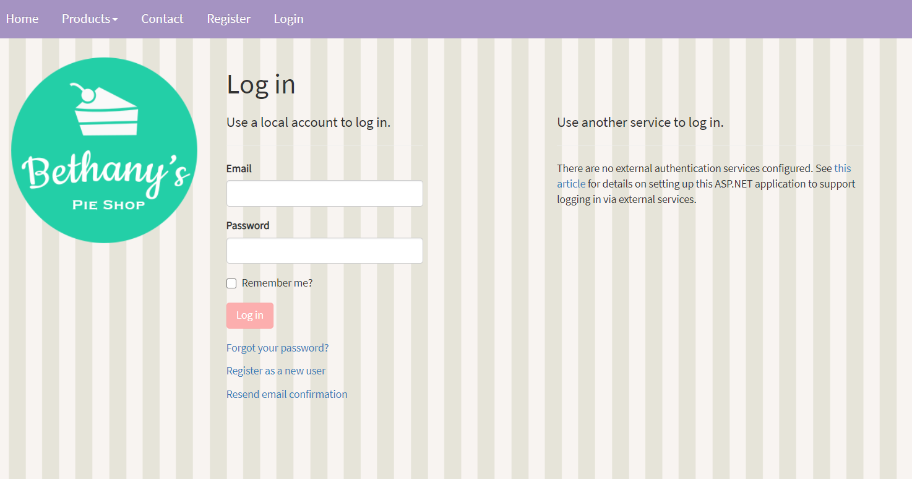
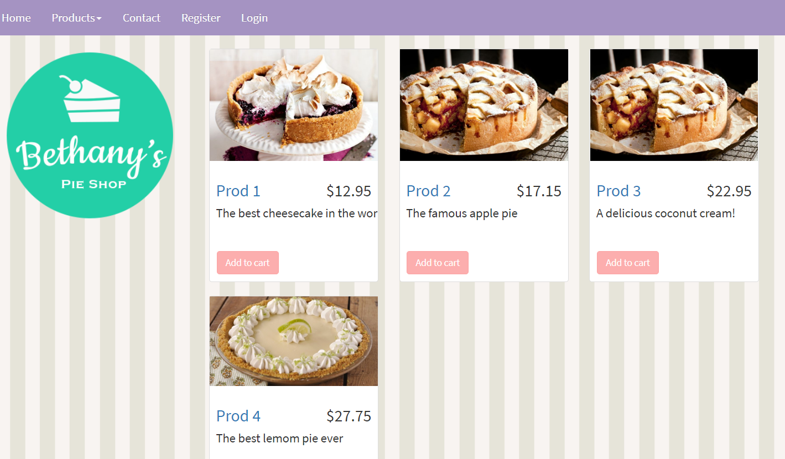

# netcore-e-commerce
<h2>A small e-commerce project made with .net core 3.0</h2>

This project was made to training my ASPNET Core skills. 

Pages included: 
* Login - using ASPNETCORE Auth
* Home - with products on sale
* Shopping Cart
* Product Catalog ordered by Categories
* Contact

Below we can see some images from project

